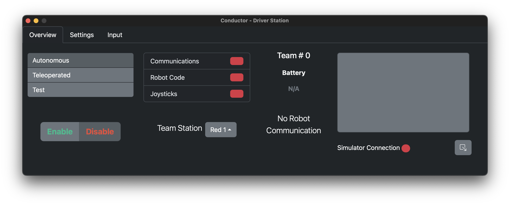
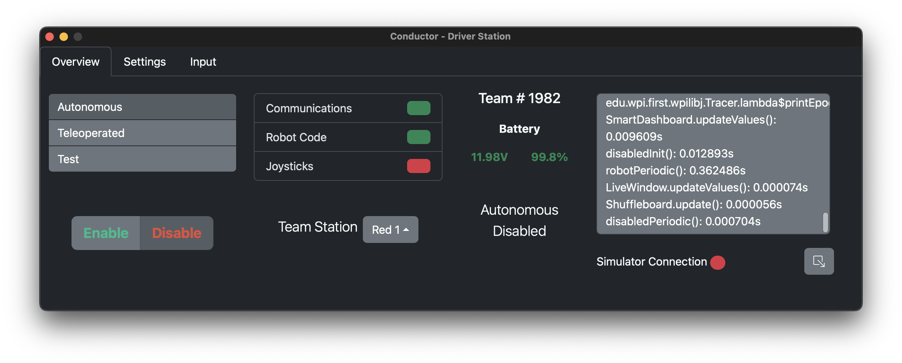
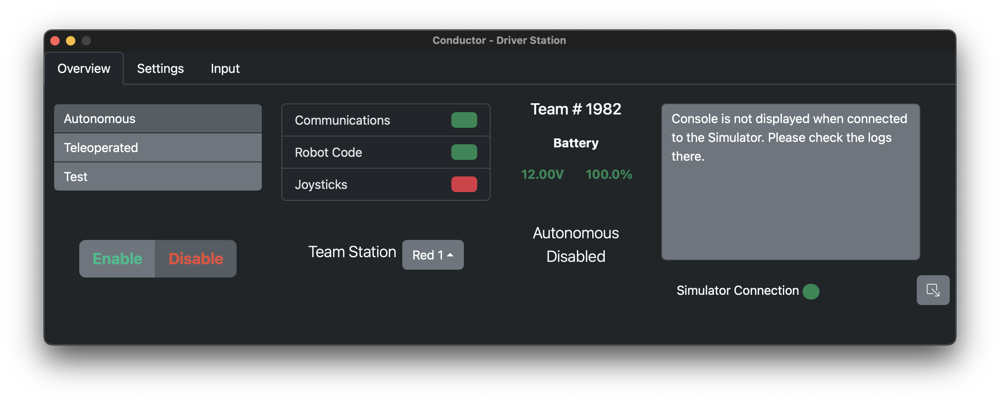
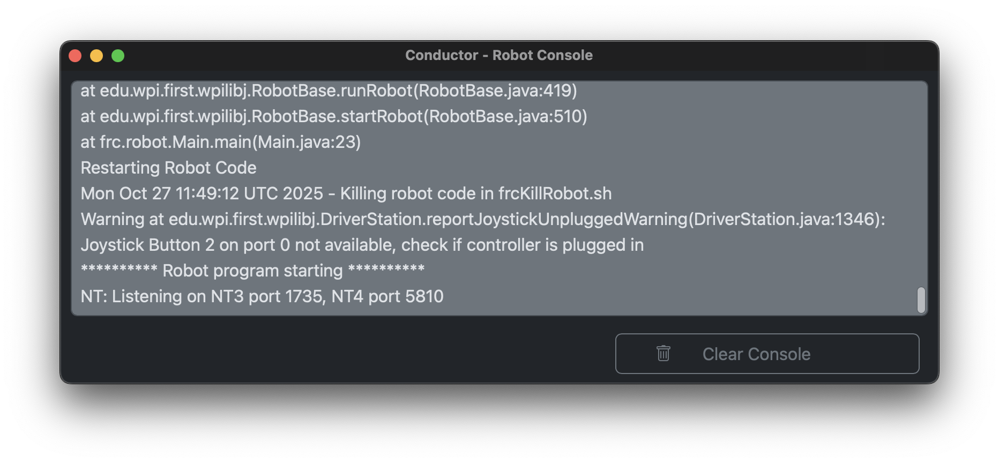
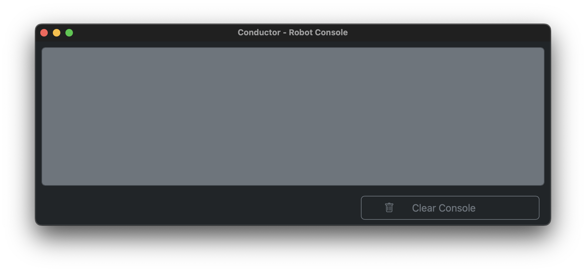
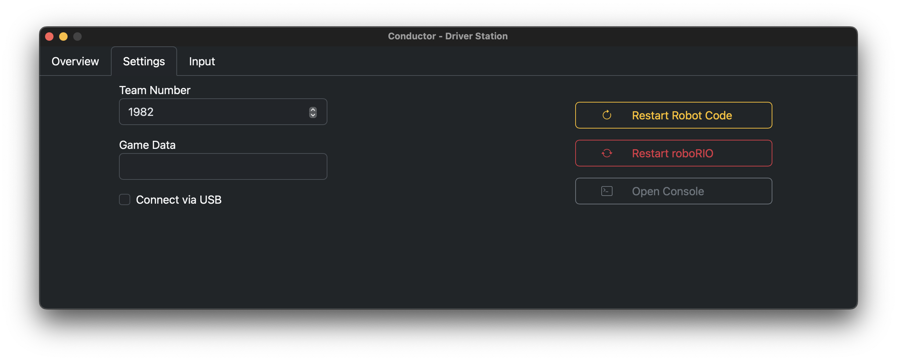
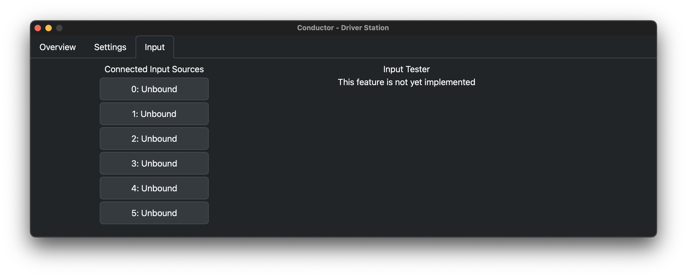

# Conductor: A cross-platform FRC Driver Station

Conductor is a Driver Station for FRC robots for all desktop platforms which supports nearly<sup>*</sup> every feature of the NI Driver Station.

<sup>*</sup>Conductor cannot yet auto-launch dashboards, and is not and will never be compatible with the Field Management System. 

# Installing Conductor

Prebuilt binaries are automatically generated by GitHub Actions for each release. To install Conductor, simply navigate to the [releases](https://github.com/SMNWTeam1982/Conductor/releases) and download the installer for your platform. If preferred or for development, Conductor can be built from source. See the [Building](#building-conductor-from-source) section for information on how to do this.

# Usage

Conductor is designed to emulate the design of the NI Driver Station as closely as possible. The main window is split into three sections, Overview, Settings, and Input, with a secondary window serving as a resizable console output view.

## Overview Tab



*The overview tab of Conductor when not connected to a robot*



*The Overview tab of Conductor when connected to a robot*

The overview tab is very similar to the equivalent tab in the NI Driver Station. On the far left are selectors for the mode, and buttons to enable or disable the robot. In the middle there are boxes indicating connection status, voltage, team number, and current operating mode. On the right is the live console view for seeing messages from the Robot.

Underneath the console view is the simulator status indicator and console window button. The simulation indicator is normally red, including when connected to a physical robot. It lights up green when Conductor is connected to a simulator instance on the local machine. The console button on the opposite side will open a new resizable window with the live console view.



*The Overview tab of Conductor with a connection to the WPILib Simulator*

## Console


When connected to a robot with the Console window open, the logs from the roboRIO and code are displayed, and automatically scroll to the bottom.



*The Console window with no output from the robot or simulator.*

## Settings



The second tab in the main window is for configuring functions that only need to be set once, such as team number, and game data.

The first accessible field is the team number field. This will update the number displayed in the control tab, and will also configure the IP to which Conductor will try to connect. The target IP is the familiar 10.TE.AM.2 IP, filled in with the value provided.


### NOTE: Connecting via USB has some bugs, only select this option after you have confirmed that you are connected.
The "Connect via USB" checkbox enables users to override the team number IP and connect to `172.22.11.2` if the you are tethered to the roboRIO via a USB connection.

The game data field can be used to update the Game Specific Message given to robot code. This can be used similar to the NI Driver Station to test code that uses this message.

On the right side are buttons to restart user code, and reboot the roboRIO. These function as they do in the NI Driver Station.

## Input



### NOTE: This has not yet been re-implemented in the Tauri application. It will be finished soon.
The final tab allows for the binding and mapping of Input devices. The list on the left displays all currently connected Input devices and the ID which they are mapped to. This list is drag and drop, updating the mappings as the items are reordered. The Input tester on the right side allows for the bindings of your Input device to be tested. It shows the axes of the joystick(s), as well as any buttons on the attached Input device. When a new Input device is detected, it will replace an 'Unbound' entry in the list. To test an Input device, click on it once without dragging it.


# Building Conductor from Source

Before building, ensure that you have the following dependencies installed:

- A Rust toolchain (e.g. installed via [Rustup](https://rustup.rs))
- [Bun Runtime](https://bun.sh) & Package Manager (Recommended)

## Ubuntu
```bash
# Dependencies
sudo apt-get install -y libwebkit2gtk-4.0-dev libwebkit2gtk-4.1-dev libappindicator3-dev librsvg2-dev patchelf

# Bun
curl -fsSL https://bun.sh/install | bash

# Rust
curl --proto '=https' --tlsv1.2 -sSf https://sh.rustup.rs | sh
source "$HOME/.cargo/env"
cargo install cargo-bundle

# Conductor
git clone https://github.com/SMNWTeam1982/Conductor
bun install
bun run tauri build
```  
  
## Mac
```bash
# Dependencies
xcode-select --install

# Bun
curl -fsSL https://bun.sh/install | bash

# Rust
curl --proto '=https' --tlsv1.2 -sSf https://sh.rustup.rs | sh
source "$HOME/.cargo/env"
cargo install cargo-bundle

# Conductor
git clone https://github.com/SMNWTeam1982/Conductor
bun install
```  

Building a release build of Conductor is simple; after cloning the repository run `bun run tauri build` to compile the Tauri app for your current platform. When this process is completed, you can find the compiled driver station at `src-tauri/target/release/conductor/bundle`. 

# Contributing

To develop on Tauri, simply follow the instructions for installing dependencies and cloning the repository. A development server for the React app can be started with `bun run dev` to work on the frontend, and `bun run tauri dev` can be used to start the rust application as well. All re-compilations and re-renders are handled in realtime by Tauri.